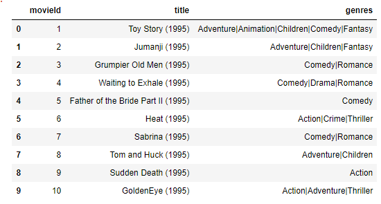
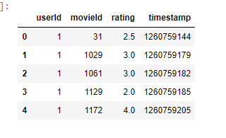
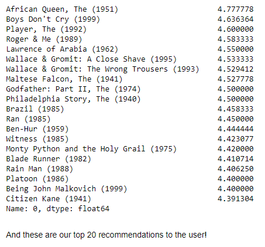

# netfix-recomendation-Sys-mini-project
## k-means Clustering of Movie Ratings
Say you're a data analyst at Netflix and you want to explore the similarities and differences in people's tastes in movies based on how they rate different movies. Can understanding these ratings contribute to a movie recommendation system for users? Let's dig into the data and see.

The data we'll be using comes from the wonderful MovieLens user rating dataset. We'll be looking at individual movie ratings later in the notebook, but let us start with how ratings of genres compare to each other.

### Here is how movie data looks like:

### Here is how users data rate on movies looks like:

### Here is the output the top 20 movies recommended for specefic user id :

